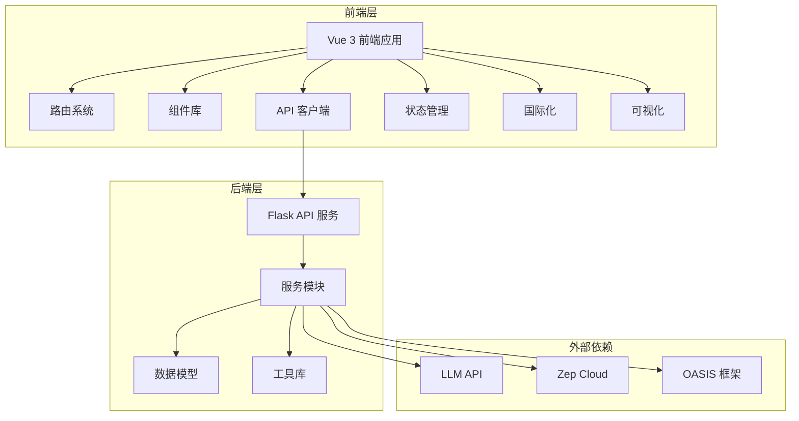

# WorldFish 项目设计文档

## 1. 项目概述

**WorldFish** 是一个基于 MiroFish 分叉的世界观模拟推演引擎，专为创作者设计。它允许用户输入世界观设定、年代大事记、人物信息、世界走向等数据，然后进行深度的世界观推演。

### 1.1 核心价值

- **创作者工具**：为小说作家、游戏设计师等创作者提供强大的世界观构建和推演工具
- **历史研究辅助**：模拟历史事件的不同可能性，为历史研究提供新视角
- **未来预测**：基于现有趋势预测未来发展，为决策提供参考

### 1.2 应用场景

- **小说创作**：构建和推演完整的虚构世界
- **游戏设计**：设计游戏世界观和剧情发展
- **历史研究**：模拟历史事件的不同可能性
- **未来预测**：基于现有趋势预测未来发展

## 2. 系统架构

WorldFish 采用前后端分离的架构设计，包含前端应用、后端API服务和外部依赖（LLM API、Zep Cloud）三大部分。

### 2.1 架构图



### 2.2 核心组件

#### 2.2.1 前端层

- **Vue 3 前端应用**：负责用户界面渲染和交互
- **路由系统**：管理不同功能模块的页面导航
- **组件库**：包含世界观构建、时间线编辑、实体管理、推演面板、地图编辑器等核心组件
- **API 客户端**：封装与后端API的通信逻辑
- **状态管理**：Vuex 管理应用状态
- **国际化**：Vue I18n 支持多语言
- **可视化**：D3.js 用于地图和关系图谱

#### 2.2.2 后端层

- **Flask API 服务**：处理前端请求，提供RESTful API
- **服务模块**：包含世界观提取、时间线管理、模拟运行等核心业务逻辑
- **数据模型**：定义世界观、实体、事件、项目等数据结构
- **工具库**：提供日志、LLM客户端、文件解析等通用功能

#### 2.2.3 外部依赖

- **LLM API**：提供大语言模型能力，用于世界观提取、智能体生成等
- **Zep Cloud**：提供长期记忆存储和检索能力
- **OASIS 框架**：基于OASIS框架定制的模拟引擎

## 3. 核心功能模块

### 3.1 世界观构建

世界观构建模块允许用户创建和管理虚拟世界的设定，包括基本信息、设定管理、时间线和地图。

#### 3.1.1 功能特点

- **多维度数据管理**：支持管理地理、政治、经济、文化等多个维度的世界观数据
- **AI 辅助提取**：上传文本文件，AI 自动提取关键信息并结构化
- **实体关系管理**：可视化管理人物、国家、组织等实体及其关系
- **时间线管理**：创建和管理世界历史事件，支持多历法系统
- **地图管理**：定义世界地理和地区关系

#### 3.1.2 实现细节

- 前端：`WorldBuilderView.vue` 组件实现用户界面，`TimelineEditor.vue` 处理时间线编辑，`EntityManager.vue` 管理实体，`MapEditor.vue` 处理地图编辑
- 后端：`world_build.py` API 处理世界观相关请求
- 服务：`WorldExtractor` 负责从文本提取世界观信息，`TimelineManager` 管理时间线

### 3.2 双模式推演引擎

双模式推演引擎是WorldFish的核心，支持两种推演模式：未知推演和已知推演。

#### 3.2.1 功能特点

- **未知推演**：基于现有设定，预测未来发展
- **已知推演**：细化已有时间线，丰富细节
- **智能体模拟**：多智能体交互，模拟社会演化
- **实时监控**：实时监控推演过程和事件发展

#### 3.2.2 实现细节

- 前端：`SimulationView.vue` 和 `SimulationPanel.vue` 组件实现用户界面
- 后端：`simulation.py` API 处理模拟相关请求
- 服务：`simulation_engine.py` 基于OASIS框架定制的推演引擎

### 3.3 世界线管理

世界线管理模块允许用户保存和管理推演项目，支持时间线回溯和重新推演。

#### 3.3.1 功能特点

- **项目持久化**：保存完整的推演项目
- **时间线回溯**：支持回到任意时间点重新推演
- **变数注入**：随时添加新的设定和变量

#### 3.3.2 实现细节

- 前端：`ProjectManager.vue` 组件实现用户界面
- 后端：`project.py` API 处理项目管理相关请求
- 服务：项目管理服务处理项目的保存和加载

### 3.4 结果分析与可视化

结果分析与可视化模块负责分析模拟结果，生成报告并进行可视化展示。

#### 3.4.1 功能特点

- **自动报告生成**：基于模拟结果自动生成推演报告
- **可视化展示**：通过地图、时间线、关系图谱等形式展示分析结果
- **智能体交互**：与推演中的人物进行对话

#### 3.4.2 实现细节

- 前端：相关组件实现用户界面，D3.js 用于可视化
- 后端：相关API处理报告和交互请求
- 服务：报告生成服务和交互服务

## 4. 技术实现

### 4.1 前端技术栈

- **框架**：Vue 3
- **构建工具**：Vite
- **状态管理**：Vuex
- **路由**：Vue Router
- **国际化**：Vue I18n
- **可视化**：D3.js (用于地图和关系图谱)
- **UI 组件**：自定义组件

### 4.2 后端技术栈

- **框架**：Flask
- **语言**：Python 3.11+
- **包管理**：uv
- **AI 集成**：OpenAI SDK
- **记忆管理**：Zep Cloud
- **模拟引擎**：基于 OASIS 框架定制

### 4.3 外部服务

- **LLM API**：支持OpenAI SDK格式的API
- **Zep Cloud**：提供长期记忆存储和检索
- **OASIS 框架**：提供智能体模拟基础

### 4.4 关键技术实现

#### 4.4.1 世界观提取

```python
# WorldExtractor 核心实现
def extract_from_text(self, text):
    # 使用LLM从文本中提取世界观信息
    # 解析提取结果为结构化数据
    # 返回提取的世界观数据
```

#### 4.4.2 双模式推演引擎

```python
# SimulationEngine 核心实现
def run_simulation(self, world_id, mode, params):
    # 加载世界观设定
    # 初始化智能体
    # 根据模式执行推演
    # 记录推演结果
    # 返回推演数据
```

#### 4.4.3 世界线管理

```python
# ProjectManager 核心实现
def save_project(self, project_data):
    # 保存项目数据
    # 处理项目版本控制
    # 返回项目ID
```

## 5. 设计指南

### 5.1 设计哲学

WorldFish 采用"克制冷静的科技感"（Calm Tech Minimalism）设计哲学，旨在创造一个既专业又现代的用户界面。

#### 5.1.1 空间与形式

- 开放、整洁的空间布局
- 大量的留白和清晰的边界
- 简洁的几何形状，以直线和直角为主
- 视觉上的一致性和功能性

#### 5.1.2 色彩与材质

- 中性的白色、浅灰色和深灰色为主
- 少量的蓝色作为强调色
- 平滑、哑光的表面质感
- 避免过多的渐变和复杂的纹理

#### 5.1.3 比例与节奏

- 网格系统和精确的比例关系
- 交互元素的大小和间距经过精确计算
- 缓慢、平滑的过渡动画
- 平静而专业的用户体验

#### 5.1.4 构图与平衡

- 平衡与和谐的整体构图
- 对称的布局和清晰的视觉层次
- 严格的网格系统
- 清晰的信息层次

#### 5.1.5 视觉层次

- 简洁的视觉层次设计
- 微妙的阴影、边框和颜色对比
- 轻微的颜色变化和微妙的动画效果
- 增强用户操作的确认感

#### 5.1.6 专家工艺

- 极致的工艺品质
- 像素级的完美
- 字体选择注重可读性与现代感的平衡
- 信息传达的清晰度和视觉的和谐性

### 5.2 前端设计规范

#### 5.2.1 组件设计

- **命名规范**：使用 PascalCase 命名组件，例如 `WorldBuilderView.vue`
- **文件结构**：按功能模块组织组件，例如 `views/`、`components/`
- **样式规范**：使用 BEM 命名约定，例如 `.world-builder__header`
- **响应式设计**：确保在不同设备上的良好显示

#### 5.2.2 交互设计

- **操作反馈**：所有用户操作都应有明确的反馈
- **加载状态**：长时间操作应显示加载状态
- **错误处理**：清晰的错误提示和处理机制
- **导航逻辑**：直观的页面导航和流程

#### 5.2.3 视觉设计

- **色彩方案**：遵循"克制冷静的科技感"设计哲学
- **字体选择**：使用现代无衬线字体，确保可读性
- **图标使用**：简洁、一致的图标系统
- **动画效果**：平滑、自然的过渡动画

### 5.3 后端设计规范

#### 5.3.1 代码组织

- **模块划分**：按功能模块组织代码，例如 `api/`、`services/`、`models/`
- **命名规范**：使用 snake_case 命名文件和函数
- **文档规范**：为所有API和关键函数添加文档字符串
- **错误处理**：统一的错误处理机制

#### 5.3.2 API设计

- **RESTful API**：遵循RESTful设计原则
- **请求/响应格式**：统一的JSON格式
- **状态码**：使用标准HTTP状态码
- **参数验证**：严格的请求参数验证

#### 5.3.3 性能优化

- **缓存策略**：合理使用缓存减少重复计算
- **并行处理**：利用并行计算提高模拟效率
- **资源管理**：合理管理外部API调用和资源使用

## 6. 开发流程

### 6.1 环境设置

1. **前端环境**：
   - Node.js 18+
   - npm

2. **后端环境**：
   - Python 3.11+
   - uv 包管理器

3. **环境变量**：
   - LLM_API_KEY：LLM API密钥
   - LLM_BASE_URL：LLM API基础URL
   - LLM_MODEL_NAME：LLM模型名称
   - ZEP_API_KEY：Zep Cloud API密钥

### 6.2 开发工作流

1. **前端开发**：
   - 启动开发服务器：`npm run frontend`
   - 构建生产版本：`npm run build`

2. **后端开发**：
   - 启动开发服务器：`npm run backend`
   - 运行测试：`pytest`

3. **集成开发**：
   - 启动前后端服务：`npm run dev`
   - 运行代码检查：`npm run lint`

### 6.3 部署流程

1. **Docker部署**：
   - 构建镜像：`docker build -t worldfish .`
   - 运行容器：`docker compose up -d`

2. **手动部署**：
   - 安装依赖：`npm run setup:all`
   - 启动服务：`npm run start`

## 7. 未来发展

### 7.1 功能扩展

- **多语言支持**：增强国际化能力
- **更多模拟场景**：支持更多类型的模拟场景
- **高级分析工具**：提供更强大的数据分析和可视化工具
- **用户协作**：支持多用户协作构建和模拟

### 7.2 技术升级

- **性能优化**：进一步提高模拟效率和响应速度
- **模型升级**：集成更先进的LLM模型
- **架构演进**：考虑微服务架构，提高系统可扩展性
- **安全性增强**：加强系统安全性和数据保护

### 7.3 生态建设

- **插件系统**：开发插件系统，支持功能扩展
- **社区贡献**：鼓励社区贡献和反馈
- **文档完善**：提供更详细的开发文档和用户指南
- **案例库**：建立模拟案例库，为用户提供参考

## 8. 结论

WorldFish 是一个专为创作者设计的世界观模拟推演引擎，通过构建和推演虚拟世界，为小说作家、游戏设计师等创作者提供了强大的工具。其"克制冷静的科技感"设计哲学和强大的技术实现，使其成为一个既美观又实用的专业工具。

通过不断的功能扩展和技术升级，WorldFish 有望在未来成为世界观构建和推演领域的领先解决方案，为创作者和研究者提供更强大的工具和更丰富的体验。